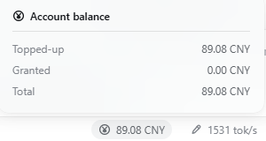
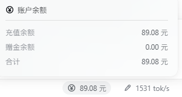

**dsh-show-balance**: Show account balance directly in the status bar. 【For: deepseek-harness-v0.2.0-rc.2】

It adds one cell left of the shipped session-statistics strip — or left of the prefill-speed cell when
that plugin is installed — showing the wallet balance, and opens a panel with the recharge, granted
and total figures. The cell renders nothing while the account is signed out.



## Install

Two ways in. Both end with the same last step: **fully restart the app** — the browser bundle is
snapshotted when the boot graph is composed, so a page refresh is not enough.

**A. From npm** — nothing to clone:

1. Add the package to your DSH profile. DSH's plugin manager installs it by name (`Settings → Plugins`,
   or the `plugin_manager` agent tool), or run this inside `<dsh home>/profiles/<profile>`:

   ```sh
   pnpm add dsh-show-balance@0.2.0-rc.2   # drop @… once a stable release exists
   ```

2. Check that the package name is listed in `dsh.profile.bundles` in that profile's `package.json`
   (installing through the plugin manager does this for you).
3. Restart the app.

**B. From this repository** — source, offline, or a version npm does not serve:

```sh
pwsh -File .\install.ps1               # Windows: link this checkout
sh ./install.sh                        # macOS / Linux
pwsh -File .\install.ps1 -From npm     # …or install the published package instead
pwsh -File .\install.ps1 -From npm -Ref 0.2.0-rc.2   # …pinned, as a prerelease-only release needs
```

The script performs steps 1–2 for you, backs up the manifest it edits, and prints step 3.

## What it shows

| Row         | Value                                                                           |
| ----------- | ------------------------------------------------------------------------------- |
| dock cell   | the wallet balance, two decimals                                                |
| `Topped-up` | the recharge wallet (CNY when the account has one)                              |
| `Granted`   | the sum of the granted wallets — the row exists only if the account reports one |
| `Total`     | `Topped-up` + `Granted`                                                         |

The unit is copy, not data: a CNY wallet reads `CNY` in an English UI and `元` in a Chinese UI, while
any other currency keeps its own ISO code in both. The language is read when the cell renders, so
switching the UI locale updates it without reinstalling.

An account holding several currencies gets one `amount currency` per currency, joined by `+` — the
figures are never converted, so no exchange rate is invented. Both extra rows need a granted wallet:
without one, the panel shows the recharge row alone. A granted wallet reported as `0.00` stays
visible, where the shipped account page hides zero grants.

Clicking the cell opens a portaled dialog anchored above it; `Escape`, a click outside, or a second
click closes it.

## Where the number comes from

`ctx.get('remote.account')` → `getBalance(metadata)` — the same authenticated Remote the shipped
**Settings → Account** page reads. The browser sends no credential; the Host attaches the stored grant.
The lookup repeats on every read (the client registers remote namespaces while it connects) and the
balance is re-read every 30 seconds.

A signed-out account answers `null`, and a failed read is treated the same way: the cell renders
nothing, because a stale or invented number would be worse than an absent one.

## Files

| File                         | Role                                                                                       |
| ---------------------------- | ------------------------------------------------------------------------------------------ |
| `index.js`                   | Host half: contributes nothing, but is the Loader row the browser half attaches to         |
| `client.js`                  | Browser half: the dock cell, its dialog, styles, copy and the account read                 |
| `cordis.patch.yml`           | Inserts the Host row                                                                       |
| `install.ps1` / `install.sh` | Install into a DSH profile — links this checkout, or `-From npm` for the published package |

## Notes

* Amounts are shown with two decimals; Platform's full decimal precision is not displayed.
* The granted balance is a separate row and is not part of the headline figure, matching the shipped
  account page's separation of recharge and granted wallets.
* Unofficial plugin; it uses only public surfaces (the account Remote and the
  `conversation.composer.dock` slot).

## License

MIT — see [LICENSE](LICENSE).

---

**dsh-show-balance**：直接在状态栏显示账户余额。【适用于：deepseek-harness-v0.2.0-rc.2】

位置在内置「会话统计」左边（装了输入统计插件时，就在它左边）；点开面板可看充值、赠金与合计三行；未登录时什么都不显示。



## 安装

两种方式，最后一步一样：**完全重启应用**——浏览器 bundle 在启动组合时快照，刷新页面不够。

**A. 从 npm 安装** —— 不用 clone：

1. 安装到 DSH profile：可以用 DSH 的插件管理器按包名安装（设置 → 插件，或 `plugin_manager` 工具），也可以在 `<DSH 主目录>/profiles/<profile>` 里执行：

   ```sh
   pnpm add dsh-show-balance@0.2.0-rc.2   # 出了正式版就去掉 @… 部分
   ```

2. 确认该 profile `package.json` 的 `dsh.profile.bundles` 里有这个包名（用插件管理器装的话它会替你写）。
3. 重启应用。

**B. 从本仓库安装** —— 源码 / 离线 / npm 上没有的版本：

```sh
pwsh -File .\install.ps1               # Windows：链接当前克隆
sh ./install.sh                        # macOS / Linux
pwsh -File .\install.ps1 -From npm     # 也可以直接装 npm 上的已发布版本
pwsh -File .\install.ps1 -From npm -Ref 0.2.0-rc.2   # 只有预发布版时必须钉住版本
```

脚本会替你做完第 1–2 步（并备份它改过的 manifest），然后提示第 3 步。

## 显示内容

| 行             | 值                                                   |
| -------------- | ---------------------------------------------------- |
| 状态栏上的格子 | 钱包余额，保留两位小数                               |
| `充值余额`     | 充值钱包（账号有 CNY 钱包时取 CNY）                  |
| `赠金余额`     | 赠金钱包之和——只有当账号报告了赠金钱包时才出现这一行 |
| `合计`         | 充值 + 赠金                                          |

单位属于文案而非数据：CNY 钱包在英文界面显示 `CNY`、中文界面显示 `元`；其他币种两种语言都保留自己的 ISO 代码。语言在渲染时读取，所以切换界面语言即时生效，不用重装。

账号持有多个币种时，按币种分别汇总、用 `+` 连接，绝不做汇率换算——凭空造一个汇率比少显示一行更糟。赠金的两行（赠金余额、合计）都以「账号报告了赠金钱包」为前提：没有赠金时面板只显示充值余额一行。金额为 `0.00` 的赠金钱包仍然显示，而出货账号页会把 0 赠金隐藏。

点格子会在它上方弹出一个面板（portal 挂到 body）；`Esc`、点面板外、再点一次格子都能关掉。

## 数字从哪里来

`ctx.get('remote.account')` → `getBalance(metadata)`——与出货的 **设置 → 账号与余额** 页读的是同一个已鉴权 Remote。浏览器不发送任何凭据，由宿主附上已保存的授权；每次读取都重新解析这个服务（客户端是连上之后才注册 remote 命名空间的），余额每 30 秒刷新一次。

未登录时宿主返回 `null`，读取失败也一样处理：格子什么都不渲染——一个过期或凭空的数字比没有数字更糟。

## 文件

| 文件                         | 作用                                                         |
| ---------------------------- | ------------------------------------------------------------ |
| `index.js`                   | 宿主半边：本身不贡献任何东西，只是浏览器半边挂靠的 Loader 行 |
| `client.js`                  | 浏览器半边：格子、面板、样式、文案与取数                     |
| `cordis.patch.yml`           | 插入宿主行                                                   |
| `install.ps1` / `install.sh` | 装进 DSH profile（默认链接本地克隆，`-From npm` 装已发布版） |

## 说明

* 金额显示两位小数，不展示开放平台返回的完整精度。
* 赠金是单独一行、不计入格子上的主数字，与出货账号页把「充值/赠金」分开的口径一致。
* 非官方插件，只使用公开接口（账号 Remote 与 `conversation.composer.dock` 槽位）。

## 许可

MIT，见 [LICENSE](LICENSE)。
